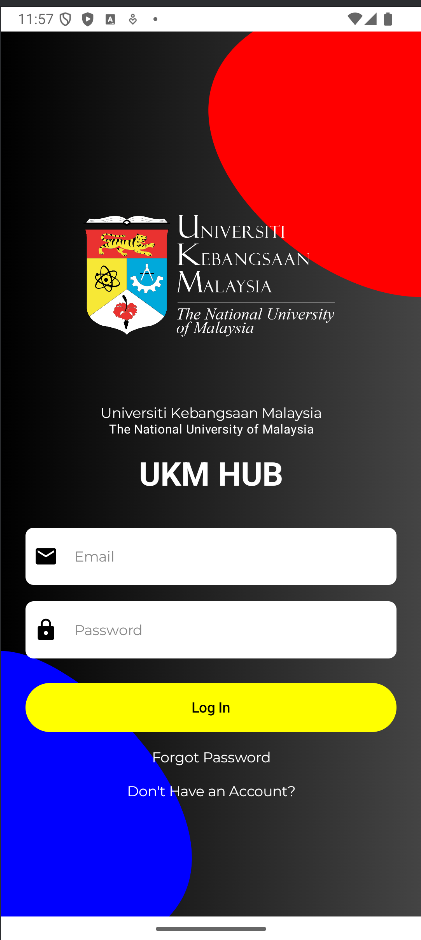
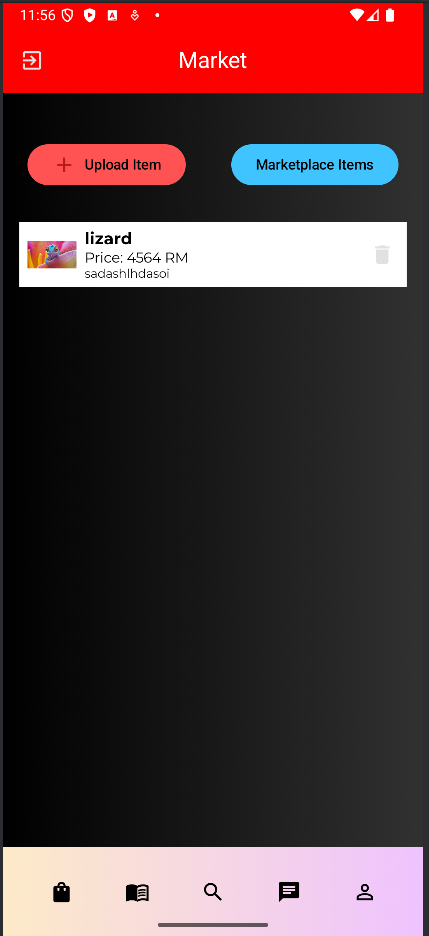
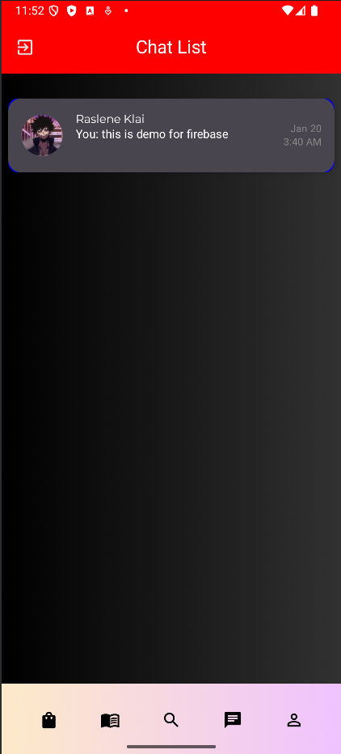

# UKM Student Hub

## One-line Description
UKM Student Hub is a student-first mobile prototype connecting UKM students through a campus marketplace, peer finder, chat system, course records, and profile management — built as a focused alternative to social media for campus life.

---

## 🎬 Demo
[Watch Demo on YouTube](https://youtu.be/rKbOmRUdYAo)

---

## 🏗 Project Status
**Type:** Prototype / Solo Project by Raslene Klai  
**Current State:** Core app features implemented and working locally; not deployed due to lack of institutional integration/support.

### ✅ Completed Features
- **Authentication:** Email registration, login, sign out, password reset (Firebase Auth)  
- **Marketplace:** Create/edit/delete/list items (title, description, price, category, image)  
- **Chat:** Basic in-app chat between users (Firestore-backed)  
- **Peer Finder:** Search students by name, faculty, year, or course  
- **Course/Profile Management:** Add/view course records and personal profile fields (name, contact, year, semester, faculty, country, birthday)  
- **Client-side validation & image upload** (simple compression + Firebase Storage)  

### ⚠ Work in Progress / Blocked
- Automatic matric number & faculty database integration — blocked due to lack of faculty access/support  
- Play Store / public release — requires institutional approval  
- Analytics / metrics collection — minimal, not instrumented  
- UI polish / error handling improvements  

---

## 👨‍💻 My Role
**Solo Developer** — full stack mobile development (UI, client logic, Firebase integration, basic backend rules)  
- Designed, implemented, and tested the app alone using Android Studio + Kotlin and Firebase services  

---

## 🛠 Tech Stack
- **Client:** Android (Kotlin), Android Studio  
- **Backend / Services:** Firebase (Auth, Firestore, Storage, Security Rules)  
- **Storage / DB:** Firestore for app data; Storage for images  
- **Build / Release:** Android Studio (APK artifact)  

---

## 📂 Assets / Screenshots

---

## ⚙ How to Run (Developer)
### Requirements
- Android Studio (Arctic Fox or later recommended)  
- JDK 11+ (handled by Android Studio)  
- Firebase project (must add `google-services.json` locally)

### Steps
1. Clone the repo  
2. Create a Firebase project and enable **Auth**, **Firestore**, **Storage**  
3. Download `google-services.json` and place it in `app/` (**do not commit this file**)  
4. Open project in Android Studio and sync Gradle  
5. Run on an emulator or physical device  

---

## 🏛 Architecture
- Client-only prototype with Firestore as the primary data layer  
- Collections: `users`, `items`, `chats`, `courses`  
- Security rules enforce ownership (only owners can edit/delete their items)  

---

## 📖 What I Learned
- Production-level Firebase setup and security rules  
- Shipping a small Android app end-to-end (auth, storage, read/write flows)  
- Building an MVP solo under limited institutional support  

---

## 📫 Contact
- **Email:** klairaslen@gmail.com  
- **GitHub:** [https://github.com/raslenkl](https://github.com/raslenkl)
- **LinkedIn:** https://www.linkedin.com/in/raslen-klai-532513197/
